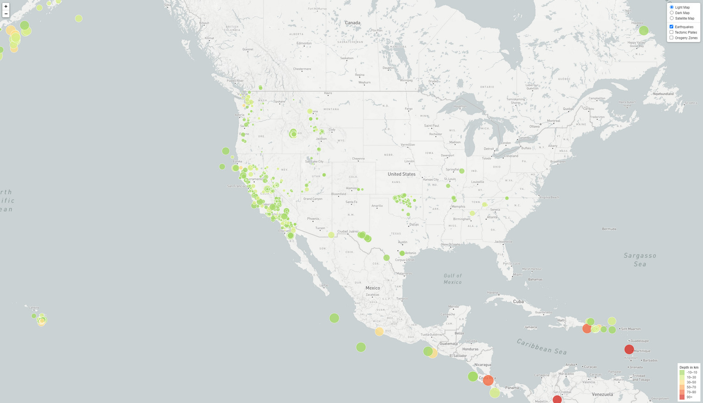
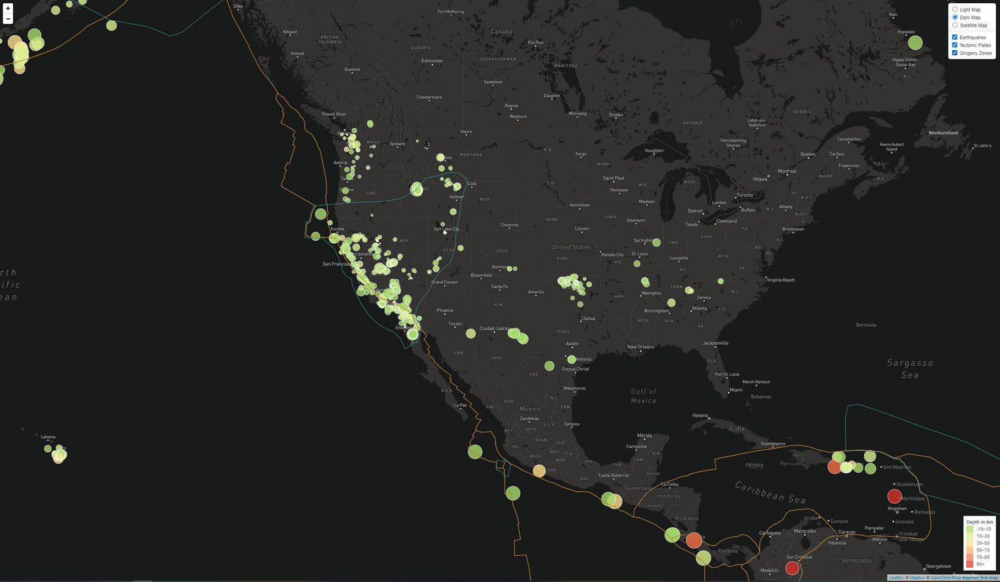
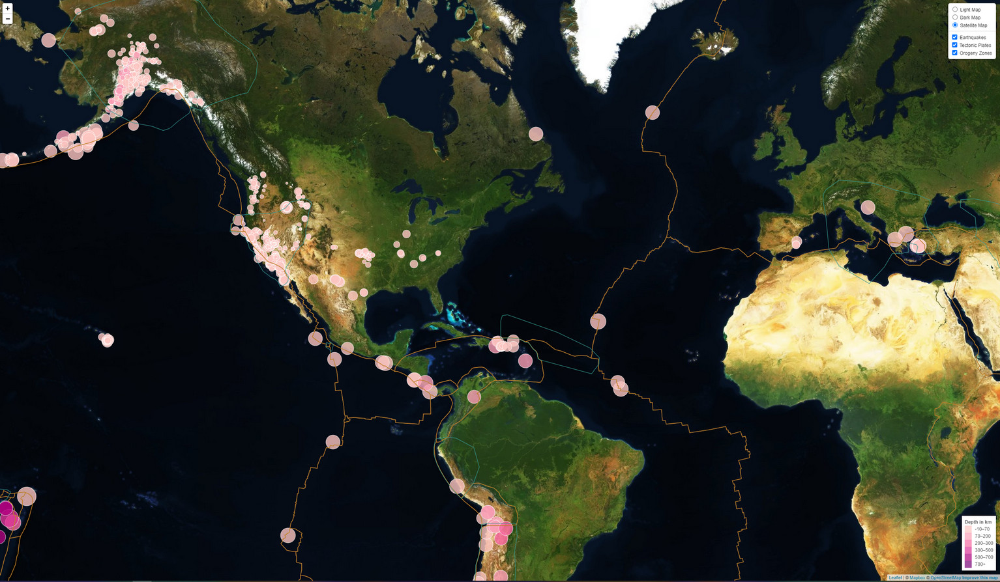

The USGS is responsible for providing scientific data about natural hazards, the health of our ecosystems and environment; and the impacts of climate and land-use change. Their scientists develop new methods and tools to supply timely, relevant, and useful information about the Earth and its processes. 

Steps:

1. The USGS provides earthquake data in a number of different formats, updated every 5 minutes. Visiting the [USGS GeoJSON Feed](http://earthquake.usgs.gov/earthquakes/feed/v1.0/geojson.php) page, I picked the weekly data set to use. It is fairly easy to change the set buy replacing week with month. 

2. Create circle markers to represent each earthquake using its lat/long coordinates

3. The markers will also be sized by their magnitude, I used a multiplier of 4 to each one to make the markers not only bigger but also help differentiate the magnitudes a little more.

4. Each marker is colored by its depth in a range. I made multiple sets because one to match the example and one to break them down as shallow, intermediate and deep. See comments in javascript

5. Added a couple of additional base maps to choose from (Light Map, Dark Map, Satellite Imagery)

6. Because I have a background in GIS, I really wanted to see if I could get the shapefiles in without using a GeoJSON. I added tectonic plates and a orogen layer.

---
MY MAPS
Basic Map that meets class requirements

Fancy map that has more layers and background

Map with different depth scale and color scheme

Resources: 

A list of links that really helped me with this assignment

Leaflet Docmentation:
[Leaflet](https://leafletjs.com/reference-1.7.1.html#marker)
[Circle Markers](https://leafletjs.com/reference-1.7.1.html#circlemarker)
[geoJSON](https://leafletjs.com/examples/geojson/)
[Choropleth](https://leafletjs.com/examples/choropleth/)
[Legend title](https://groups.google.com/g/leaflet-js/c/mtO2xWTA0VY?pli=1)
[Legend with Color](https://leafletjs.com/examples/choropleth/)
[geoJSON](https://leafletjs.com/examples/geojson/)

Earthquake Info
[Magnitude Scales](http://www.geo.mtu.edu/UPSeis/magnitude.html)
[Depth Range](https://www.usgs.gov/natural-hazards/earthquake-hazards/science/determining-depth-earthquake?qt-science_center_objects=0#qt-science_center_objects)
[Eathquake geoJSOn Format](https://earthquake.usgs.gov/earthquakes/feed/v1.0/geojson.php)

Help with colors! -> [Color Brewer](https://colorbrewer2.org/#type=diverging&scheme=BrBG&n=11)

Tectonic Data -> [Tectonic Plates](https://github.com/fraxen/tectonicplates)

Basic shapefiles in leaflet -> [Shapefiles Leaflet](https://hub.packtpub.com/shapefiles-leaflet/#more)
This guy Calvin did a whole bunch of ground work for shapefiles into leaflet [Shapefile Code](https://github.com/calvinmetcalf).